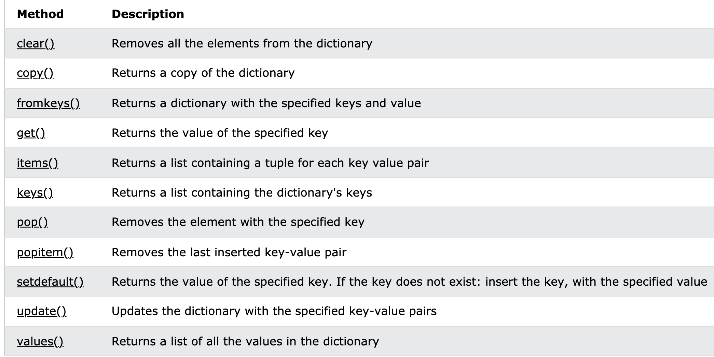
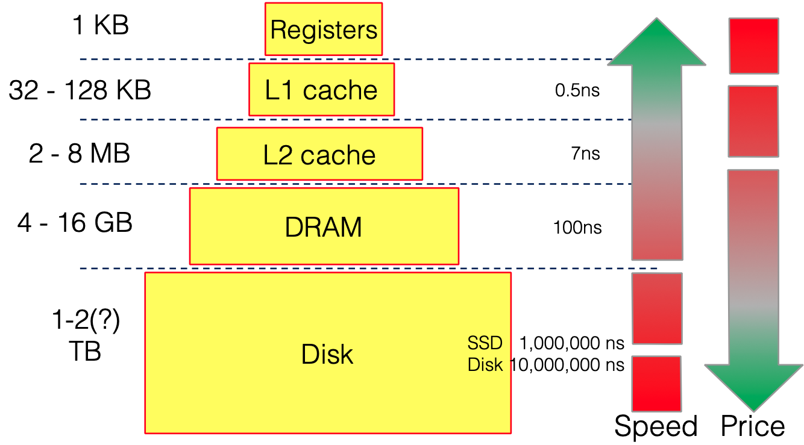
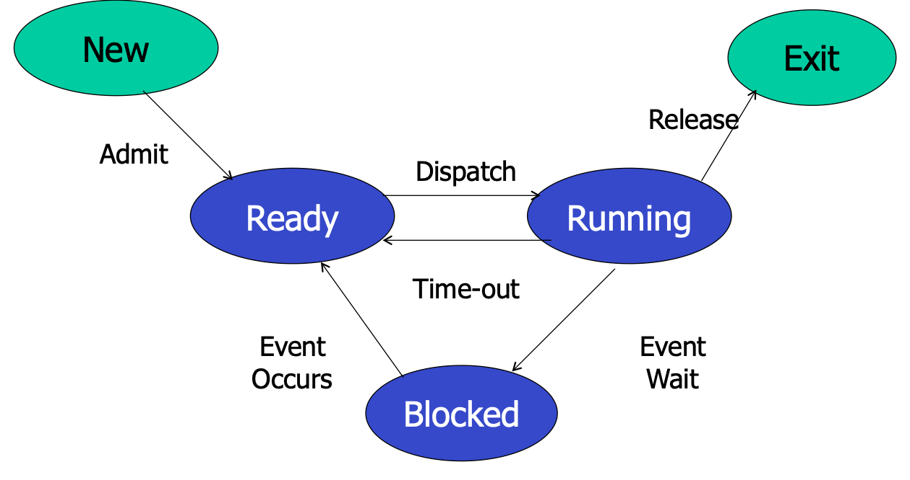

# Backend Development Basics Review
# Python functions
### Ceiling Function 
    Math.ceil(p / K) = ((p-1) // K) + 1
### Sort key-value pairs first by values then keys
    # my_list: a list of key-value pair tuples
    for key, value in sorted(my_list, key=lambda x:(x[1], x[0])):
        res.append(key + " " + value)

### Dictionary functions

### bisect (binary search)
    bisect.bisect_left(a, x, lo=0, hi=len(a))

Locate the insertion point for x in a to maintain sorted order. The parameters lo and hi may be used to specify a subset of the list which should be considered; by default the entire list is used. If x is already present in a, the insertion point will be before (to the left of) any existing entries. The return value is suitable for use as the first parameter to list.insert() assuming that a is already sorted.

The returned insertion point i partitions the array a into two halves so that all(val < x for val in a[lo:i]) for the left side and all(val >= x for val in a[i:hi]) for the right side.

## Special Python functions and values
### str.split()
By default, split the str by any white spaces.

### str.strip()
Remove spaces at the beginning and at the end of the string.

### list.sort()
Sort the list in-place in ascending order.

### float('-inf') / float('inf')

### list(#a string)
Split a string into arrays with elements separated as items.

### collections.OrderedDict()

### key in dict
syntax to check if the dictionary dict contains the key.
# Algorithms
## Union-Find (Rank and Path Compression)
    def find(parent, i):
      if parent[i] != i:
        parent[i] = find(parent, parent[i])
      return parent[i]

    def union(rank, x, y):
      if rank[x] > rank[y]:
        parent[y] = x
      elif rank[y] > rank[x]:
        parent[x] = y
      else:
        parent[y] = x
        rank[x] += 1
  
    parent = [i for i in range(n)]
    rank = [0] * n
    for (i, j) in ...:
        m = find(parent, i)
        n = find(parent, j)
        if m != n:
          union(rank, m, n)

## Binary Search
    function binary_search(A, n, T) is
        L := 0
        R := n − 1
        while L ≤ R do
            m := floor((L + R) / 2)
            if A[m] < T then
                L := m + 1
            else if A[m] > T then
                R := m − 1
            else:
                return m
        return unsuccessful
## Binary Trees
#### **In-order traversal**
    Algorithm Inorder(tree)
      1. Traverse the left subtree, i.e., call Inorder(left-subtree)
      2. Visit the root.
      3. Traverse the right subtree, i.e., call Inorder(right-subtree)
#### **Pre-order traversal**
    Algorithm Preorder(tree)
      1. Visit the root.
      2. Traverse the left subtree, i.e., call Preorder(left-subtree)
      3. Traverse the right subtree, i.e., call Preorder(right-subtree) 
#### **Post-order Traversal**
    Algorithm Postorder(tree)
      1. Traverse the left subtree, i.e., call Postorder(left-subtree)
      2. Traverse the right subtree, i.e., call Postorder(right-subtree)
      3. Visit the root.
   
## Minimum Spanning Trees
#### **Prim Algorithm** O(ElogV)
    # Prim's Algorithm in Python

    INF = 9999999
    # number of vertices in graph
    N = 5
    #creating graph by adjacency matrix method
    G = [[0, 19, 5, 0, 0],
        [19, 0, 5, 9, 2],
        [5, 5, 0, 1, 6],
        [0, 9, 1, 0, 1],
        [0, 2, 6, 1, 0]]

    selected_node = [0, 0, 0, 0, 0]

    no_edge = 0

    selected_node[0] = True

    # printing for edge and weight
    print("Edge : Weight\n")
    while (no_edge < N - 1):
        
        minimum = INF
        a = 0
        b = 0
        for m in range(N):
            if selected_node[m]:
                for n in range(N):
                    if ((not selected_node[n]) and G[m][n]):  
                        # not in selected and there is an edge
                        if minimum > G[m][n]:
                            minimum = G[m][n]
                            a = m
                            b = n
        print(str(a) + "-" + str(b) + ":" + str(G[a][b]))
        selected_node[b] = True
        no_edge += 1

#### **Kruskal Algorithm** O(V^2)
Leverages Union-Find

    KRUSKAL(G):
    A = ∅
    For each vertex v ∈ G.V:
        MAKE-SET(v)
    For each edge (u, v) ∈ G.E ordered by increasing order by weight(u, v):
        if FIND-SET(u) ≠ FIND-SET(v):       
        A = A ∪ {(u, v)}
        UNION(u, v)
    return A

## Depth-First Search O(V)
Implemented using a stack.
class Graph:

    def __init__(self,V): # Constructor
        self.V = V        # No. of vertices
        self.adj  = [[] for i in range(V)]  # adjacency lists
 
    def addEdge(self,v, w):     # to add an edge to graph
        self.adj[v].append(w)    # Add w to v’s list.
 
 
    # prints all not yet visited vertices reachable from s
    def DFS(self,s):            # prints all vertices in DFS manner from a given source.
                                # Initially mark all verices as not visited
        visited = [False for i in range(self.V)]
 
        # Create a stack for DFS
        stack = []
 
        # Push the current source node.
        stack.append(s)
 
        while (len(stack)):
            # Pop a vertex from stack and print it
            s = stack[-1]
            stack.pop()
 
            # Stack may contain same vertex twice. So
            # we need to print the popped item only
            # if it is not visited.
            if (not visited[s]):
                print(s,end=' ')
                visited[s] = True
 
            # Get all adjacent vertices of the popped vertex s
            # If a adjacent has not been visited, then push it
            # to the stack.
            for node in self.adj[s]:
                if (not visited[node]):
                    stack.append(node)

### DFS for binary trees (Recursion)
    def dfs(s: TreeNode, info):
      if not s:
        return # or return False
      # Some operations with s.val
      dfs(s.left, info)
      dfs(s.right, info)
### Notes
1. Recursion is usually preferred because of cleaner code.
2. If an algorithm (e.g. topological sort) requires to mark verticies as black (explored), gray (visited) or white (unvisited), then we must write recursion instead of the while loop.
3. We can pass information from parents to children by leveraging parameters and return values.
## Breadth-First Search O(V)
Implemented using a queue.

## Topological Sort O(V+E)
1. Initialize a new array *arr*.
2. For each of the unvisited nodes in our graph, we run **DFS**.
3. Suppose we are visiting node *s*. After recursing on all of *s*'s children, we add *s* to *arr* because all jobs that need *s* as a prerequisite are already in *arr*.
4. Once all the nodes have been processed, we simply return *arr* in the reversed order.  

## Dynamic Programming
### Outline
- Breaking the problem down into simpler subproblems, solve each subproblem just once, and store their solutions.
- The next time the same subproblem occurs, instead of recomputing its solution, simply look up its previously computed solution.
- Hopefully, we save a lot of computation at the expense of modest increase in storage space.

## Hash Table
If let array elements be keys and array indices be values, we can reduce the lookup time from $O(n)$ to $O(1)$ by **trading space for speed**. 

Example: Leetcode #1

# Operating Systems
**x86** iis a family of instruction set architecture initially developed by Intel. 
## Virtual Memory
Each process in a multitaskiing OS runs in its own memory sandbox. This is the **virtual address space**, which in case of a 32-bit system is always a **4GB** block of memory addresses. 

Since the smallest unit addressable by the CPU is **1 byte = 8 bit**, it turns out that a 32-bit CPU is able to generate up to $2^{32}$ addresses. These virtual addresses are then mapped to real, physical memory addresses by **page tables** in **memory management unit (MMU)**, which are kept by the operating system kernel.

Since the OS kernel is a process itself, it has a dedicated portion of the virtual address space, separated from the portion reserved for any other user's application processes. 

The following picture shows a possible split between the OS kernel and the user mode virtual memory spaces on a typical 32-bit Linus OS.

## How a process looks like within the user mode portion of the virtual address space

#### **Text (Code)**
- Contains executable instructions of a program. 
- Usually sharable, so that only a single copy needs to be in memory for frequently executed programs.
- Often *Read-only* or *Executable*
#### **Data (Initialized data segment)**
- Contains the **global** and **static** variables that are initialized by the programmer.
- Not *Read-only*, values of the variables can be altered at run time.
- Further classified into 
  - initialized *Read-only* area. e.g. a string literal
  
        const char* str = "hello world"

  - initialized *Read-Write* area. e.g. the following C statements outside the main.
    
        char s[] = "hello world"
        int debug = 1
#### **BSS (Block Started by Symbol) /**  **Unitialized data segment**
- Data in this segment is initialized by the OS kernel of arithmetic 0 before the program starts executing.
- *Read-Write*
- Contains all global and static variables initialzied to zero or not inialized in source code. e.g.

        static int i

#### **Stack**
- Contains the program stack, an **LIFO** structure
- (In x86) Grows downwards to lower addresses
- Store all data needed by a function call in the program.
- Specifically, the set of values pushed for one function call is named a **stack frame**. A **stack pointer** register tracks the top of the stack, and is adjusted each time a value is pushed onto the stack. If the stack pointer meets the **heap pointer**, the available free memory is exhausted.

#### Heap
- Dynamic memory: memory requested by the programmer for variables whose size can be only known at run-time.
- Managed by <tt> malloc</tt> and <tt>free</tt>, which may use the <tt>brk</tt> and <tt>sbrk</tt> system calls to adjust its size.

### Physical Memory Hierarchy

## Processes and System Calls
- A process contains all of the state for a program in execution.
  - An  address space 
  - The  code + data  for the executing program
  - An execution  stack  encapsulating the state of procedure calls
  - The  program counter (PC)  indicating the next instruction
  - A set of general-purpose  registers with current values
  - A set of operating system resources
    - Open files, network connections, signals, etc.
- A process is named using its   process ID (PID)  

### Process life cycle

 context switch: switch the CPU to another process by
- saving the state of the old process
- loading the saved state for the new process
  
When can this happen?
- Process calls <tt> yield()</tt> system call (voluntarily)
- Process makes other system call and is blocked
- Timer interrupt handler decides to switch processes

### Process Creation
A process is created by another process. Parent is the creator, child is created. In Linux, the parent is the <tt>PPID</tt> field of the <tt>ps -f</tt>.

The init process (PID 1) creates the first process. The main task of the init process is to call <tt>wait()</tt> in a loop which collects the terminaton status of any process that it has adopted.

#### fork(): process are created.
- Creates and initializes a new PCB
- Creates a new address space
- Initializes the addresss space with a copy of the entire contents of the address space of the parent
- Initializes the kernel resources to point to the resources used by parent (e.g. open files)
- Places the PCB on the ready queue
- Returns in two processes
  - returns the child's PID to the parent, "0" to the child.

#### exec(): start a new program
- Stops the current process
- Loads program into the process's address space
- Initializes hardware context and args for the new program
- Places the PCB onto the ready queue
  
Note: It does not create a new process.

### Process Destruction
#### exit(): a process voluntarily releases all resources
But OS cannot discard everything immediately.
- Stopping a process requires context switch to another process
- Parent may be awaiting or asking for the return value

When a process exits,
- Address space is freed
- Files are closed
- Some OS data structures retain the process's exit state
- PID is retained
- The process is now a zombie until its parent collect its terminaton status.
  - If it does not have a parent, then it is cleaned up by the init process.
  
We call the child process an "orphan" when its parent terminates first. When a process becomes an orphan, it is "adopted" by the init process. 

###  System Calls
Function calls that invokes the operating system.
#### Interrupts
- **Hardware interrupt**: Interrupts signal CPU that a hardware device has an event that needs attention. e.g.
  - timer interrupt
  - seg fault
  - divide by zero
- **Software trap or exception**: Interrupts signal errors or requests for OS intervention. e.g. system call.
  - Some instructions are **privileged instructions** which can only run in kernel mode.
  - On a "system call interrupt", the mode bit is switched to allow privileged instructions to occur.

#### mmap
Creating shared memory regions.

## Processes & threads
How do processes communicate?
- signals
- pipes
- sockets
- shared files
- shared memory (e.g. threading, semaphores)
- message queues

### Thread
A **thread** is a single control flow through a program. A program wth multiple control flows is **multithreaded**.
- **Kernel-level threads**: modern OSs have taken the execution aspect of a process and separated it out into a thread abstraction. All thread operations are implemented in the kernel and the OS schedules all of the threads in the system.
- **User-level threads**: Managed entirely by the run-time system
  - Small and fast: A thread is simply represented by a PC, registers, stack, and small thread control block (TCB).
  - Threads easily share code, heap and global variables.
  - Creating a new thread, switching between threads, and  synchronizing threads are done via procedure call, no kernel involvement.

#### Processes vs. threads
- Processes are more heavy-weight than threads and have a higher startup/shutdown cost
- Processes are safer and more secure (each process has its own address space)
  - A thread crash takes down all other threads
  - A thread's buffer overrun creates security problem for all

#### POSIX Threads (pthreads)
Standardized C language threads programming API.

## Deadlocks
- Root causes:
  - Resources are finite
    - Hardware
    - Data
    - Synchronization objects
  - Processes wait if a resource they need is unavailable
  - Resources may be held by other waiting processes

### Conditions for deadlock
1. **Mutual exclusion**: Only one process may use a resource at a time.
2. **Hold and wait**: A process may hold allocated resources while awaiting assignment of others. 
3. **No preemption**: No resource can be forcibly removed from a process holding it.
4. **Circular wait**: A closed chain of processes exits, such that each process holds at least one resource needed by the next process in the chain.

### Deadlock Prevention
Idea: Break one of the four conditions and deadlock cannot occur.

# System Programming
### Signals
A mechanism that allow a process or the operating system to interrupt a currently running process and notify it that an event has occured.

#### sigaction()
Modify the signal table so that a new signal handling function is called instead of the default action.

Each signal is identified by a number between 1 and 31.
### I/O
#### pipe()
Pipe is one type of communication mechanism that can be used to send data between related processes.
- Specified by an array of two file descriptors: stored in fd
      - One for reading data from the pipe: the 0th element fd[0]
      - One for writing data to the pipe: the 1th element fd[1]
- Unidirectional

When the program calls <tt> pipe()</tt>,
- The operating system creates the pipe data structures and opens two file descriptors on the pipe
- The pipe system call returns.

#### select()
      int select(numfd, read_fds, write_fds, error_fds, timeout)
Avoid the situation where parent waiting for an indefinite child while the other child has a lot to say.

Idea: the caller specifies a set of file descriptors to watch. The second parameter is the address of the set of descriptors from which the user wants to read.  Select blocks until one of these file descriptors has data to be read or until the resource has been closed. In either case, the user is certain now that calling read on that file descriptor will not cause <tt> read()</tt> to block. We will say that a file descriptor like this (with data or with a closed resource) is "ready".

#### socket()
      int socket (int domain, int type, int protocol)
Sockets are built on the TCP protocol to communicate between processes on two different machines.

#### epoll()
      int epoll_create1(int flags);
      int epoll_ctl(int epfd, int op, int fd, struct epoll_event *event);
      int epoll_wait(int epfd, struct epoll_event *events, int maxevents, int timeout);

<tt> epoll()</tt> is meant to replace <tt>select()</tt> and <tt> poll()</tt> for a scalable I/O event notification mechanism. It monitors multiple file descriptors to see if I/O is possible on any of them.

##### epoll() vs. select()
- We can add and remove file descriptor while waiting.
- <tt> epoll_wait()</tt> returns only the objects with ready file descriptors.
- epoll has better performance – O(1) instead of O(n).

#### assert()
void assert( int expression );
If expression evaluates to 0 (false), then the expression, sourcecode filename, and line number are sent to the standard error, and then <tt>abort()</tt> function is called.

<tt> abort()</tt> terminates the process by raising a SIGABRT signal.

# Computer Networks
## TCP
### Three-way handshake
1. Host A send a SYN to the host B
   1. SYN=1, sequence number=x
2. Host B returns a SYN acknowledgement (SYN ACK)
   1. SYN=1, ACK=1, sequence number=x, ACKnum=x+1
3. Host A sends an ACK to acknowledge SYN ACK
   1. SYN=0, ACK=1, ACKnum=y+1

### Four-way handshake
Tearing down TCP connections.
1. Host A send a FIN to the host B, indicating it has no packets to send out but can still receive data.
   1. FIN=1, sequence number=x
2. Host B returns an ACK. When A receive the packet, A will wait for B to close the connection.
   1. ACK=1, ACKnum=x+1
3. Host B sends a FIN to the host A to request closing the connection and wait for acknowledgment. B can no longer send data.
   1. FIN=1, seq=y
4. Host A sends an ACK to the host B
   1. ACK=1, ACKnum=y+1

### Flow control
Flow control
- The receiver specifies the *receive window* field that it is willing to buffer for the connection. 
- When receiver advertises a window size of 0, the sender stops sending data and starts the *persist timer*. When the timer expires, the sender attempts recovery by sending a small packet so that the receiver responds by sending another acknowledgement containing the new window size.

### Congestion Control
- Slow start
  - Exponential Growth: increase window size one segment each time an ACK is received.
- Congestion avoidance mechanism
  - Additively increase the window size when successfully send a window of data.
- Fast recovery algorithm
  - Used for decreasing the window size upon packet loss.
  
### UDP
- Unreliable message delivery service
- Lightweight communication between processes
- No delay for connection establishment
- No connection
- Small packet header overhead (8 bytes)

Applications: telephone calls, video conferencing, gaming.
## Hypertext Transfer Protocol (HTTP)
An application layer (TCP/IP based) client-server protocol that allows web-based applications to communicate and exchange data.

- Connectionless
- Stateless
- Can deliver any sort of data
  
### Hypertext Transfer Protocol Secure (HTTPS)
An extention of HTTP. It is used for secure communication over a computer network, and is encripited using Transport Layer Security (TLS) or, formerly, Secure Sockets Layer (SSL). It forbids the intermediate nodes on the network to see the data in delivery.
### Encryption of HTTPS
Involves both symmetric and asymmetric encryption.
#### Handshake mechanism
- The client sends out a request to the server.
- The server generates a public key and a private key for asymmetric encrytion. It sends out the public key to the server along with a public certificate signed by the certification authority.
- The client uses certificate to verify the public key belongs to the server. The client then generates the symmetric key for symmetric encryption, encrypts this key using the public key.
- The server then decrypts the message using its private key.
- The client and the server can then communicate safely using the symmetric key.

Requires a trusted Certification Authority (CA) to verify server's identity (signed with CA's private key). Client can verify certificate (and thus server identity) using CA's public key.

# C++
## Virtual function
A **virtual function** is a member function in the base class that we expect to redefine in derived classes. It ensures that the function is overriden.

## Constructor
A **constructor** in C++ is a special method that is automatically called when an object of class is created. 

When declared inside the class, the constructor can be defined ouside the class by specifying the name of the class followed by the scope resolution <tt>::</tt>.

      class Car {        // The class
        public:          // Access specifier
            string brand;  // Attribute
            string model;  // Attribute
            int year;      // Attribute
            Car(string x, string y, int z); // Constructor declaration
      };

      // Constructor definition outside the class
      Car::Car(string x, string y, int z) {
            brand = x;
            model = y;
            year = z;
      }

      int main() {
            // Create Car objects and call the constructor with different values
            Car carObj1("BMW", "X5", 1999);
            Car carObj2("Ford", "Mustang", 1969);

            // Print values
            cout << carObj1.brand << " " << carObj1.model << " " << carObj1.year << "\n";
            cout << carObj2.brand << " " << carObj2.model << " " << carObj2.year << "\n";
            return 0;
      }

